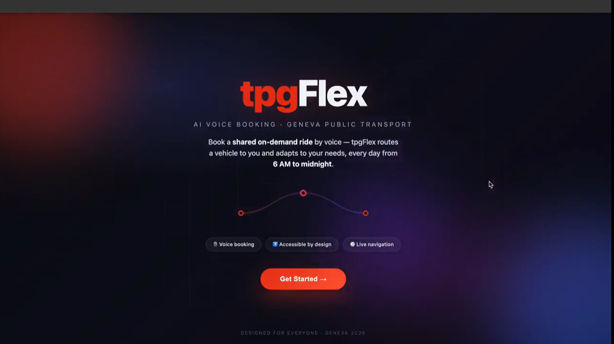
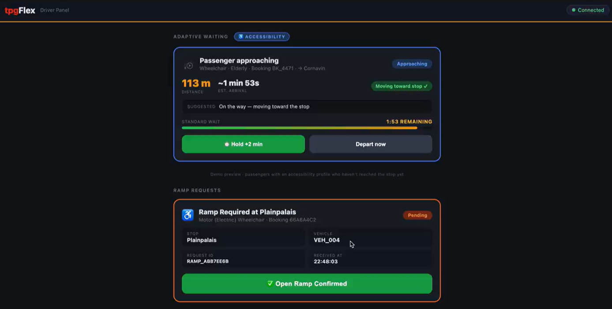
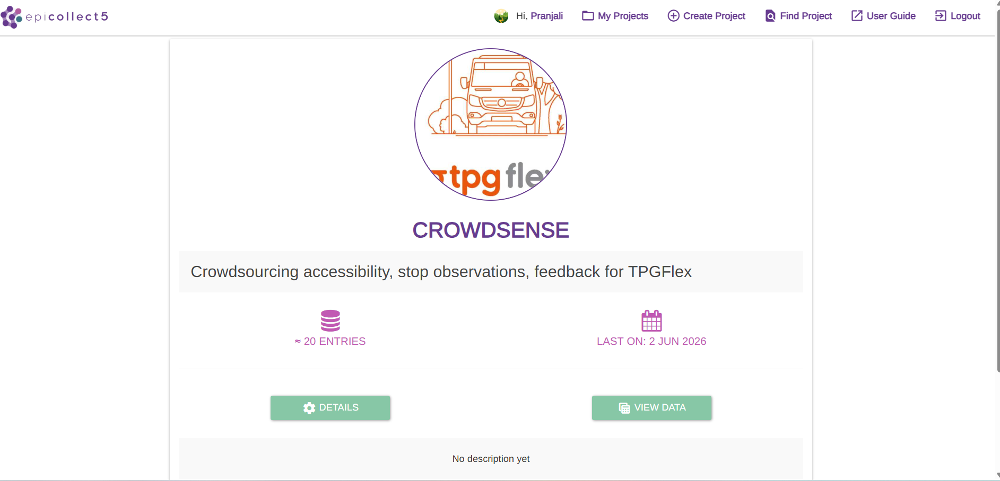
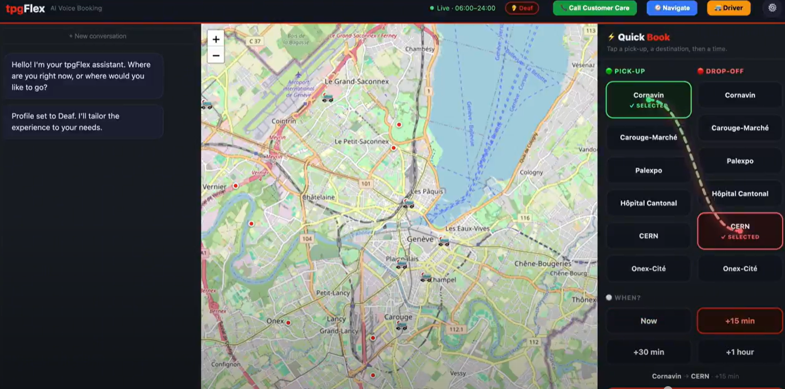
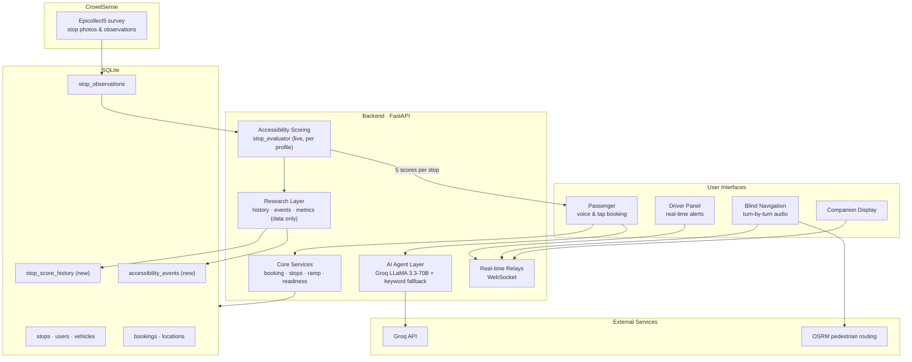

# AIBility — Accessibility Intelligence for Inclusive Public Transport

<p align="center">
  
</p>

<p align="center">
  <em>AIBility accessibility-aware mobility platform built around TPG Flex, Geneva's on-demand transport service.</em>
</p>

AIBility originated within the *Crowdsourcing and AI* course at the Université de Genève under the supervision of Prof. François Grey. As part of the course, representatives from Transports Publics Genevois (TPG) presented a series of real-world mobility challenges to student teams during a challenge-based innovation programme and hackathon.

My team selected the **Accessible Mobility App** challenge, which asked participants to create or improve a mobile and web-based crowdsourcing application that would be inclusive for people with disabilities and people with low digital literacy, while respecting accessibility standards and intuitive design principles.

We designed AIBility: an accessibility-focused mobility platform built around TPG Flex, Geneva's on-demand transport service. The platform combines voice-assisted ride booking, accessibility-aware navigation, driver assistance tools, and CrowdSense, a crowdsourced accessibility data collection system designed to capture real-world conditions at transport stops.

While developing AIBility and engaging with disability organizations, I became increasingly interested in how accessibility conditions change over time, how temporary disruptions affect different communities of users, and how local accessibility challenges may influence the broader transportation ecosystem. Although the platform currently focuses on accessibility intelligence and crowdsourced mobility data, these observations motivated my decision to extend it with a research-oriented data layer capable of capturing accessibility changes, disruption events, and disability-specific impacts over time.

This led me to a broader research question:

**How do accessibility disruptions emerge, evolve, and affect different groups of users, and what can these patterns reveal about the resilience of an accessibility-focused transportation system?**

The accessibility-vulnerability research infrastructure described in this repository is my independent extension of the original AIBility platform and serves as a foundation for future studies of accessibility dynamics, transportation resilience, and network-level accessibility vulnerability.


## Project Motivation

Accessibility in public transport is not a convenience feature — it is a legal
right under the **UN Convention on the Rights of Persons with Disabilities**,
and it affects a large share of the population. Statistical sources:

| Figure | Meaning | Source |
|---|---|---|
| ~1.3 billion / ~1 in 6 | People globally living with a significant disability | World Health Organization |
| ~1.8 million | People in Switzerland living with disabilities | Swiss Federal Statistical Office |
| ~20% | Share of the Swiss population living with a disability | Swiss Federal Statistical Office |
| ~3% | Share requiring high-support accessibility | Swiss Federal Statistical Office |

The course brief (Challenge — *Accessible Mobility App*) asked us to create or
improve a mobile/web crowdsourcing application that is inclusive for people with
disabilities **and** low digital literacy, with a focus on usability,
accessibility standards, and intuitive design. AIBility is our response: a single
service that lets people book a ride in the way that suits them (voice, text, or
a few taps) and that treats accessibility information as first-class data rather
than an afterthought.

---
## From Accessibility Support to Research

During field interactions with Fondation Foyer-Handicap, Procap Genève, and accessibility users, I observed that accessibility is not a static property of a transport stop. Construction work, weather conditions, equipment failures, and operational disruptions can temporarily alter accessibility conditions and affect disability groups in very different ways.

What began as an accessibility-support project gradually evolved into a broader interest in understanding how accessibility conditions change over time, how different communities of users respond to those changes, and how transportation systems can become more resilient to accessibility-related disruptions.

This motivated the addition of a research-oriented data layer designed to capture accessibility changes, disruption events, and disability-specific impacts longitudinally.

The first objective is to build a reliable historical record of accessibility conditions through CrowdSense observations and operational transport data. The longer-term objective is to investigate whether recurring accessibility disruptions reveal broader patterns of accessibility vulnerability and resilience within transportation systems.

Crucially, the present repository does not implement those analyses. It implements the data foundation required to support them. Implemented work and future research directions are kept strictly separate throughout this document and in `RESEARCH_README.md`.

---

## Field Work and User Insights

The design was grounded in field interactions with two Geneva disability
organizations and interviews with their members. These insights shaped every
layer of the system; I report them as the qualitative observations they are, not
as quantitative findings.

**Fondation Foyer-Handicap:** Residents told us they prefer simple, accessible apps with clear information, and that the things
that matter most to them are reliable **audio announcements** and trustworthy
**accessibility details about each stop** (surface, obstacles, tactile guidance,
real-time displays). This directly motivated the audio-guided navigation mode and
the per-stop accessibility scoring.

**Procap Genève:** The main issues raised were **physical accessibility** — especially platform and vehicle height differences. The user
plans trips in advance and asked for **simpler digital support** (tutorials,
workshops, an AI assistant). This motivated the voice/tap booking flow, the ramp
request system, and the wheelchair-specific scoring profile.

**Cross-cutting lesson.** The two groups care about almost disjoint things: a
stop that is excellent for a wheelchair user can be unusable for a blind user,
and vice versa. A single "accessible / not accessible" label hides this. That
observation is the reason the platform scores every stop **per disability
profile** rather than producing one global score.

<p align="center">
  
</p>

<p align="center">
  <em>Driver assistance dashboard providing accessibility alerts, adaptive waiting recommendations, and ramp deployment requests.</em>
</p>

---

## CrowdSense Overview

<p align="center">
  
</p>

<p align="center">
  <em>CrowdSense crowdsourcing platform used to collect accessibility observations, stop conditions, safety information, and ride experience feedback from the community.</em>
</p>

CrowdSense is the crowdsourced data-collection front end, implemented as an
[Epicollect5](https://five.epicollect.net/project/crowdsense) survey. Community
members photograph bus stops and fill in a structured, multi-select observation
form (surface quality, kerb height, tactile guidance, real-time displays,
lighting, obstacles, and so on). A separate short "ride experience" form captures
rider sentiment about a completed trip.

`backend/epicollect_sync.py` pulls those entries straight from the Epicollect5
API and refreshes the `stop_observations` table. The sync is **idempotent**: it
replaces only the rows it owns (`source='epicollect'`), so manual and demo data
are preserved, and edits or deletions in the survey are reflected without
duplication. Because the scorer reads this table live, **there is no model to
retrain** — new survey responses change the scores immediately.

---

## Accessibility Intelligence Layer

<p align="center">
  
</p>

<p align="center">
  <em>Accessibility-aware ride booking interface supporting disability-specific user profiles, route selection, and AI-assisted trip planning.</em>
</p>

The accessibility intelligence layer (`backend/stop_evaluator.py`) turns raw
observations into a transparent, per-group score for each stop. It is
deliberately **deterministic and weight-based**, not a black box:

- Each survey item carries a small integer weight in one or more **profile
  weight dictionaries** (`wheelchair`, `blind`, `deaf`, `low_digital`,
  `elderly`). For example, level boarding helps wheelchair users; tactile guiding
  strips help blind users; a real-time display helps deaf and low-vision users.
- For a given stop and profile, the matched item weights are summed and
  normalized to a `[0, 1]` score with a `Good / Fair / Poor` rating.
- A stop's overall accessibility is the **worst** of its per-profile scores, so a
  stop is only "good" if it works for everyone.
- A `safety` score is computed the same way from safety-related items, and a
  simple `data_confidence` flag (`high / medium / low`) reflects how many
  observations back the score.

Two of the five displayed dimensions — **punctuality** and **service
regularity** — are currently illustrative placeholders pending a live feed of TPG
operational data; this is noted explicitly so the values are not mistaken for
measurements.

---

## Ride Experience Layer

Ride experience is scored separately, because a ride happens *between* stops
rather than at one. The "ride experience" feedback form contributes positive and
negative tags (e.g. *easy boarding*, *ramp used when needed*, *clear audio
announcements* vs *long wait*, *difficult access*, *bumpy ride*). These are
pooled across the network and scored with the same weighting approach to produce
a single, service-wide **Ride Experience** score that is shown on every stop.
This keeps stop-level *infrastructure* quality and trip-level *service* quality
as distinct, honestly-labelled signals.

---


## Architecture Diagram



---

## Current Observations / Lessons Learned

These are design observations from building the platform, not results of a
controlled study:

- **One score does not fit all.** Per-profile scoring exists because the same
  stop genuinely serves disability groups differently; collapsing that into one
  number erases the people it most affects.
- **Live scoring beats a trained model here.** Computing scores directly from the
  observation table means a single new CrowdSense report changes the map
  instantly and the logic stays auditable — valuable for a trust-sensitive,
  accessibility domain.
- **Low digital literacy is a first-class constraint.** Offering voice, text, and
  a no-conversation tap-to-book path in one service was a direct response to the
  Procap interview, not a nice-to-have.
- **Privacy can replace tracking.** Instead of live-tracking passengers, the
  driver panel uses a passenger-declared readiness status, which covers the
  operational need with far less personal data.
- **Accessibility is temporal.** The platform captured a stop's *current* state
  well but had no memory of how it changed. Closing that gap is exactly what the
  research branch below adds.

---

## Research Infrastructure Added

I added a self-contained, **data-collection-only** research branch. It records
how accessibility evolves over time and what disrupts it, without performing any
analysis on top. Existing tables and the scoring logic are untouched; every score
it stores is read straight from `stop_evaluator`. Full detail is in
[`RESEARCH_README.md`](./RESEARCH_README.md).

The current implementation focuses on establishing the infrastructure needed for longitudinal accessibility studies. While analytical modelling has not yet been implemented, the platform already supports historical accessibility tracking, disruption-event recording, and population-specific accessibility monitoring.

### Historical Accessibility Tracking

A new `stop_score_history` table stores timestamped snapshots of a stop's scores,
including a column per disability group. Calling
`POST /api/research/stops/{id}/snapshot` captures the current live scores into
this table; over time this builds the longitudinal record the research question
needs.

### Accessibility Events

A new `accessibility_events` table records disruptions per stop. Tracked event
types are **construction, elevator failure, weather disruption, temporary stop
relocation, and equipment failure**. Each event also records a **standardized
source** so a later study can filter or weight by provenance:

| Source | Meaning |
|---|---|
| `crowdsense` | Surfaced by community CrowdSense reports |
| `tpg_operations` | Reported through TPG operational channels |
| `weather` | Derived from weather conditions / alerts |
| `manual_demo` | Manually entered or synthetic demonstration data |

### Population Impact Metrics

For any stop, `GET /api/research/stops/{id}/population-impact` returns the current
accessibility score for each of four disability groups — **wheelchair, blind /
low vision, deaf / hard of hearing, and cognitive / elderly** — by reading the
existing scorer's profiles. No new scoring is introduced.

### Observation Analytics

`GET /api/research/stops/{id}/observation-analytics` returns plain descriptive
statistics for a stop: total reports, first and last report dates, and the count
of positive vs negative observations (polarity reused from the scorer's existing
weights).

---

The research layer has been designed as a longitudinal accessibility monitoring infrastructure. Although the current prototype uses seeded observations for testing and validation, its intended purpose is to accumulate real CrowdSense reports collected through Epicollect. Over time, these observations can form a time-stamped record of accessibility conditions, disruption events, and population-specific impacts across the Geneva transport network, providing the empirical foundation for future research on accessibility dynamics, network resilience, and inclusive mobility.

## Future Research Roadmap

Clearly separated from the implemented work above, the intended research
direction is:

1. **Longitudinal data.** Run `capture_snapshot` on a schedule alongside the
   Epicollect sync to accumulate real, dated accessibility histories from
   CrowdSense and TPG operational feeds.
2. **Disruption characterization.** Use the event and history tables to describe,
   per disability group, how deep an accessibility drop a disruption causes and
   how long recovery takes.
3. **Accessibility dynamics and network resilience.** Explore how recurring accessibility disruptions influence
different disability groups over time and investigate whether broader patterns of accessibility vulnerability emerge across
interconnected transportation systems.
4. **Validation with partners.** Re-engage Procap Genève and Fondation
   Foyer-Handicap to check that any modelled "vulnerability" matches lived
   experience.

The current implementation establishes the data foundation required to study accessibility dynamics over time. Historical accessibility tracking, disruption-event recording, and population-specific metrics are already operational. Future work will focus on collecting longitudinal real-world observations and exploring how accessibility disruptions propagate, evolve, and affect different disability groups across transportation systems.

---

## Getting Started

```bash
# 1. Install dependencies and seed the demo database
bash setup.sh

# 2. Provide a Groq API key (no hardcoded fallback)
echo "GROQ_API_KEY=gsk_your_key_here" > .env   # https://console.groq.com/keys

# 3. Run
uvicorn backend.main:app --reload --port 8000
```

Then open <http://localhost:8000/>. Serve the pages through the backend (not via
`file://`). Interactive API docs are at <http://localhost:8000/docs>.

Refresh stop scores from the live CrowdSense survey at any time:

```bash
python -m backend.epicollect_sync            
python -m backend.epicollect_sync --dry-run  
```

---

## Key Endpoints

| Endpoint | Purpose |
|---|---|
| `POST /voice/process` | Conversational booking (intent + reply) |
| `POST /quick-book` | One-shot tap-to-book |
| `GET /stops`, `GET /stops/nearest` | Stop lookups |
| `POST /ramp-request` | Request ramp deployment (pushed to driver panel) |
| `GET /api/route` | Pedestrian routing (OSRM) with crossing hints |
| `GET /api/stops/evaluate/{id}` | Live 5-dimension stop evaluation |
| `POST /api/stop-evaluator/sync` | Refresh scores from CrowdSense |
| `GET /api/research/stops/{id}/history` | Historical accessibility snapshots |
| `POST /api/research/stops/{id}/snapshot` | Capture current scores into history |
| `GET /api/research/stops/{id}/population-impact` | Per-group accessibility now |
| `GET /api/research/stops/{id}/observation-analytics` | Report counts + date range |
| `GET`/`POST /api/research/stops/{id}/events` | Read / record disruption events |
| `GET /api/research/events` | All events (filter by `event_type`, `ongoing_only`) |
| `GET /api/research/event-types`, `/event-sources`, `/population-groups` | Research vocabularies |

---

## Tech Stack

- **Backend:** FastAPI, Uvicorn, SQLite, httpx, faster-whisper
- **LLM:** Groq API (LLaMA 3.3-70B) with a keyword-parser fallback
- **Frontend:** Vanilla HTML/CSS/JS, Leaflet, Web Speech API, TensorFlow.js +
  COCO-SSD (object detection for navigation)
- **Routing:** OSRM public API (pedestrian)
- **Crowd data:** Epicollect5

---

## Acknowledgments

I would like to sincerely thank **Transports Publics Genevois (TPG)** for presenting the Accessible Mobility App challenge and providing the opportunity to work on a real-world accessibility problem within Geneva's public transportation ecosystem.

I am especially grateful to **Procap Genève** and **Fondation Foyer-Handicap** for generously sharing their time, experiences, and perspectives on the daily realities of accessible mobility. Their feedback, field insights, and lived experiences were instrumental in shaping both the design of AIBility and the research direction that emerged from this project.

Their contributions highlighted the importance of viewing accessibility not as a static feature, but as an evolving challenge influenced by infrastructure, operations, and the diverse needs of different communities of users.
